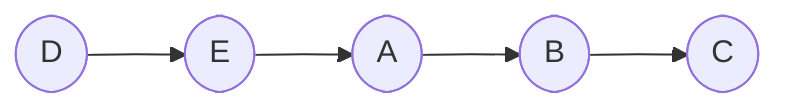

# Deadlocks
# Deadlocks
> A set of processes is **deadlocked** if each process in the set is waiting for an event that only another process in the set can cause.

In our discussion of *inter-process communication*, we were faced with the problem of deadlocks multiple times. Mainly, we saw deadlocks occurring within the *producer-consumer problem*. At first, we saw deadlocks in the form of a process waiting for a wake-up from another process (which, in turn, was waiting for a wake-up from us). Then, we saw deadlocks when we attempted to ensure mutual exclusion via semaphores, but added them in the incorrect order. Hence, until now, deadlocks made it even more difficult to devise a solution for **synchronization**. Now, we will go more in-depth into what deadlocks are and how we can deal with them as the operating system.

## Conditions for deadlock
In 1971, *Coffman et al.* were able to show that the following conditions must hold for there to be a deadlock:
1. **Mutual Exclusion**: Each resource can only be held by one process at a time.
	- For instance, a printer cannot be used by multiple processes or users simultaneously.
2. **No Preemption**: A resource that has already been granted cannot be taken away forcibly
	- For instance, the printer is generally a non-preemptive resource as another process cannot take it from you while it is printing your document.
	- Typically, a non-preemptive resource must be explicitly released by the process holding it.
	- CPU time is a preemptive resource (we can preempt it as the system), but the critical region, if we consider it as a resource, (locked by a synchronization primitive such as a mutex), is a non-preemptive resource.
3. **Hold-and-Wait**: A process gains a resource, holds it, then attempts to gain another resource, but fails and waits
	- Since we assumed that the resource is non-preemptive and mutually exclusive, when a process requests a resource, it cannot give it if another process is using it.
4. **Circular Wait**: process *A* is waiting for a resource held by process *B* which is waiting for a resource held by process *A*
	- Circular wait can be modeled with a diagram

Note that these are sufficient and necessary conditions. Hence, they are equivalent to the definition of a deadlock. Furthermore, notice that the first two conditions (Mutual-Exclusion and Non-Preemption) are properties of a resource whereas the last two conditions (Hold-and-Wait and Circular Wait) are properties of a process (or properties of how we program).

## Dealing with deadlocks
### Ignoring the problem
There are four main ways to deal with deadlocks. First, we can simply **ignore** it in the hopes of it ignoring us. There is actually an algorithm for this approach called the **Ostrich Algorithm**. In it, we simply stick our head in the sand and pretend that there is no problem.
### Detect and recover
But often times, pretending the problem doesn't exist is not the desirable solution. Instead, we can **detect** the deadlock and attempt to **recover** from it.

Let's first tackle how we can detect a deadlock. Previously, we saw that we can visually map the processes and the resources using a diagram such as below:

Notice that this is simply a *directed graph,* which means we can use *adjacency matrices* to store this information on the system. Better yet, the operating system already has this information since all resources are managed by the operating system, which allocates it to the process that make the `open()` system call. If the `open()` system call has returned, it means that the resource was allocated (*the "holds"*) and if the `open()` has not yet returned, that means the process is blocked (*the "wants"*).

Now, to detect if there is a deadlock, we just need to search our graph for a cycle! This can be done rather easily using *union find* or *depth first search with marking*. However, this is a rather expensive process, which means running it every time a process requests a resource is not a viable option. So when do we run this algorithm? There are many options, but one might be to run it with a *low priority* so that it is seldom scheduled and only runs when there is no other process to run (or all other processes are blocked, which is likely to be a deadlock). 

Once we've detected the deadlock, how can we recover?

Since the resources are non-preemptive (as is implied by a deadlock), we cannot take the resource away. Instead, we can try to *preempt* by killing a process, but this seems drastic. It also raises the question of which process to kill, which is hard to answer. For instance, if we kill the newest process, most likely the same problem will occur very soon. If instead we try to kill the longest-running process, we come to discover that most long-running processes are rather important (or the user would not be running it for a long time). Hence, there is not really a right answer.

If our system supports it, we can try to *roll-back* using a *check-point scheme*. However, this is expensive due to the large memory space required, and furthermore this approach can only be applied if the task is ***idempotent***. If the process is not idempotent (i.e., process has side effects), roll-back might cause more issues than we started with.

### Avoidance
Hence we move to the third approach in dealing with deadlocks: **avoidance**. The idea is if we are able to avoid a deadlock, we don't ever have to deal with it.

The graph below plots the resource trajectory of a printer and plotter.

Note that both axes represent *process execution* in terms of instructions. At $I1$, process $A$ requests and receive the printer. At $I2$, it requests and receive the plotter (if available) and releases the printer as $I3$. Hence, between $I2$ and $I3$, process *A* holds both the printer and the plotter. Finally, at $I4$, process *A* releases the plotter. Similarly, process $B$ requests the plotter at $I5$, and the printer at $I6$. It then releases the plotter at $I7$ and the printer at $I8$.

Assuming both devices are not sharable, the hatched region is impossible to access. The green region is known as the **safe state** and there exists a schedule that will not lead to a deadlock; the red region is the unsafe state, which leads to deadlock.

#### Banker's Algorithm
Now that we know that there exists a schedule that does not lead to deadlock, we simply need to find an algorithm that finds this schedule. To avoid deadlocks, we simply need to falsify one of the four conditions. One algorithm that does just this is called the **banker's algorithm** (it gets is name from bankers trying to prevent a run on the bank).

Consider the first scenario as illustrated below. We see that there are four process *A*, *B*, *C*, and *D*. The '*Has*' column represents how many resources each process currently holds. At the current state, all four processes are not holding on to any resources. The '*Max*' column represents the maximum amount of resources that the process *may* need *simultaneously*. Since this is a maximum for all possible runs of the program, it is very much possible that the current execution of the program may not actually need the maximum number of resources before termination. Lastly, we see that there are a total of ten free resources which can be allocated among the four processes.
|     | Has      | Max |
| --- | -------- | --- |
| A   | 0        | 6   |
| B   | 0        | 5   |
| C   | 0        | 4   |
| D   | 0        | 7   |
|     | Free: 10 |     |
We notice that no process *requires* more resources than the available amount. Hence, we note that this is a rather trivial *safe state*. We can simply run any of the four processes to completion before choosing the next one.

Now, suppose the four processes has been running for a while and have each acquired some number of resources. We see below, that process *A* has one, *B* one, *C* two, and *D* four resources.
|     | Has     | Max |
| --- | ------- | --- |
| A   | 1       | 6   |
| B   | 1       | 5   |
| C   | 2       | 4   |
| D   | 4       | 7   |
|     | Free: 2 |     |
In this state, we apply the same algorithm as before. If there is a process that we can run to completion, we run it to completion. 

For instance, here, we notice that we can run process *C* to completion without running out of resources since process *C* will request at most two more resources. Hence, we begin by running process *C* to termination while giving it the resources (at most $2$) that it needs. Then, once *C* exits, it releases its resources, and we are now left with $2+4=6$ resources.

Now with $6$ resources available, we notice that we can run either process *B* (which needs at most four more resources) or process *D* (which needs at most three more resources) to completion.

Notice that since the release of the resources is always *monotonic*, it does not really matter which process (either *B* or *D*) we choose. Even if the process we chose did not release any resources, we can simply run the other process afterward. Suppose, in this case, we choose to run process $B$. Process *B* would request at most four more resources before exiting, at which point the number of available resources becomes $6+1=7$.

Again, with seven available resources, we can choose either process *A* or process *D* to run. If we choose process *D* to run, it would request at most three resources before exiting (bringing the number of available resources to $7+4=11$). Lastly, we can run process *A* which will request at most five more resources before terminating. After *A* terminates, we have successfully exhausted our process queue and are left with a total of twelve available resources.

To summarize, given a safe state, we were able to generate a schedule that did not result in a deadlock:

Now we will look at another situation. Suppose that the four processes have run in some sort of fashion to the point where the four processes *A*, *B*, *C*, and *D* have acquired 1, 2, 2, 4 resources respectively.
|     | Has     | Max |
| --- | ------- | --- |
| A   | 1       | 6   |
| B   | 2       | 5   |
| C   | 2       | 4   |
| D   | 4       | 7   |
|     | Free: 1 |     |

We begin by noticing that this is an **unsafe state**, since there are no processes that we can run to completion with just one copy of the resource available. That is, we cannot run any process that would free up more resources.

However, this does not mean we are in a deadlock. The processes could continue to run until that last resource is requested. Or since that *Max* is for the overall executions (not this particular execution), we may even get lucky and end up in a situation in which not all the resources are claimed. Hence, our presence in the unsafe state does not *guarantee* a deadlock; however, a deadlock could occur if the processes request their maximum amount. This is due to chance however, and we wish to avoid this situation as much as possible
 
#### Banker's algorithm for multiple resources
We've seen how the banker's algorithm can help us devise a schedule that keeps us in the safe state when we have just one type of resource. However, in reality, a modern system holds a variety of resources and hundreds of processes which requests access to them.

Even in such a case, however, the banker's algorithm, with some modifications, is still applicable. We are presented with the same information as before, albeit in a bit of a different format.

The matrix below shows us how many resources have been assigned to each process. This is exactly equivalent to the "*has*" column as before, except for the fact that it now covers multiple types of resources.
| Process | Tape driver | Plotters | Scanner | CD ROM |
| ------- | ----------- | -------- | ------- | ------ |
| A       | 3           | 0        | 1       | 1      |
| B       | 0           | 1        | 0       | 0      |
| C       | 1           | 1        | 1       | 0      |
| D       | 1           | 1        | 0       | 1      |
| E       | 0           | 0        | 0       | 0      |
The next matrix show us how many more resources are needed by each process:
| Process                                                                                                                                                                           | Tape driver | Plotters | Scanner | CD-ROM                            |
| --------------------------------------------------------------------------------------------------------------------------------------------------------------------------------- | ----------- | -------- | ------- | --------------------------------- |
| A                                                                                                                                                                                 | 1           | 1        | 0       | 0                                 |
| B                                                                                                                                                                                 | 0           | 1        | 1       | 2                                 |
| C                                                                                                                                                                                 | 3           | 1        | 0       | 0                                 |
| D                                                                                                                                                                                 | 0           | 0        | 1       | 0                                 |
| E                                                                                                                                                                                 | 2           | 1        | 1       | 0                                 |
| Notice that this matrix represents how many *more* resources each process needs and not the *maximum* number of resources (as we saw before). That is, the subtraction of "$\verb | max         | -\verb   | has     | $:" has been done for us already. |

Finally, we are presented with three vectors:
- $E=\begin{pmatrix}6&4&4&2\end{pmatrix}$ which represents the *total resources*,
- $P=\begin{pmatrix}5&3&2&2\end{pmatrix}$ which represents the *resources held by the processes combined* (calculated by the *column-wise sum* of the first matrix), and
- $A=\begin{pmatrix}1&0&2&0\end{pmatrix}$ which represents the *available resources* (calculated by $E-P$).

We will now apply the same algorithm as before, checking to see if there is any process that can be run to termination with only the available number of resources. To do so, we take vector $A$ and compare with the rows of the second matrix (*resource needed*) to see if any processes can be run to termination. In our case, process *D* satisfies this condition. Hence, we run *D* until termination, which releases some resources to get $A=\begin{pmatrix}1&0&3&0\end{pmatrix}$. We, then, repeat this process until we get a schedule that looks like:

With some restrictions, we are sometime able to run multiple processes if we have enough resources to do so. 

In all, our starting state has been determined *safe* by the banker's algorithm. Yet, this raises the question of *if we run the banker's algorithm, wouldn't we never run into a state with shared resource since we run each process to completion?*. Indeed, we see that the outcome of the banker's algorithm looks much like a *batch schedule*.

Recall that the batch schedule is a system in which processes are run from creation to termination without blocks. Since a batch system does not have blocks, it cannot have share resources, and thus cannot have circular wait, meaning it is deadlock free. Thus, the banker's algorithm avoids deadlock by producing a trivial batch schedule.

In truth, the banker's algorithm doesn't produce a full batch schedule. Indeed, if we have enough resources, the banker's algorithm can interweave them. Thus, the banker's algorithm moves us from a safe state to the next safe state, while interweaving and falling back to the batch scheduling as a last resort. Nevertheless, it does help us unsafe state.

Yet, there is a big flaw in the banker's algorithm. To be able to use this algorithm, we need to know the *max* ahead of time. Since the program has not been run yet, determining this as the operating system is impossible. Instead, just as we attempted when we discussed scheduling, we can try to have the programmer provide us with these details at compile time. But there is a big issue with this.

If the programmer underestimates, it could lead us in to an unsafe state (we enter the state assuming the process doesn't need more, but we request and block). If we overestimate, we are back to batch scheduling. Hence, although theoretically deadlock free, the banker's algorithm is rather useless. It is only good if we know the *max* in advanced and are okay with batch scheduling.

### Prevention
Lastly, we can attempt to prevent a deadlock (or guarantee deadlock free). We have already seen that there are four conditions for a deadlock. Hence, to prevent one, we simply need to attack one of the four conditions.

#### Attacking mutual exclusion.
Often, a resource such as a printer implements a *spool*. When processes tries to print, instead of giving them mutual exclusion to the printer access, the device is virtualized and a job queue is constructed. Hence, when more than one processes request access to the printer, their tasks are added to the job queue and the singular resources are *shared*.

Yet, this approach has its problem. Since it requires virtualizing the queue, it requires storage space. This is fine for a printer, which requires only a few megabytes to store each file. However, for devices like a Blu-ray burner which requires more than fifty bytes, it may be impractical to construct a spool (merely a two task queue requires upwards of a hundred Gigabytes).

Additionally, devices that require a notion of timeliness (such as devices that need to be accessed in real-time), cannot allow for this as virtualization creates overhead which may hinder performance.

Furthermore, for some devices this just simply cannot be done. However, for other devices, spooling is a common approach that is taken to prevent deadlocks.

#### Attacking hold-and-wait
One of the causes of deadlocks were that the processes held on the resources while waiting (and other processes could not access those). For some systems and some resources, we can actually prevent hold-and-wait. For instance, many database-management systems use what is called *two-phase locking* (with a *read-lock* and *write-lock*) which allows the process to request all resources at the same time. If any of the request fails, the process gives up all the resources it has acquired so far, waits a little and tries again later. This system is especially useful if the required resources are known ahead of time.

Yet, the problem with this approach is that it relies on the software to follow this system of releasing when one of the resources is in use. Hence, the OS cannot enforce this mechanism and this approach becomes unreliable.

#### Attacking non-preemption
Although this is possible with some devices, for many it is not. Hence, it is not a generalizable approach.

#### Attacking circular wait
Lastly, we can try attacking circular wait in search of our universal solution. Indeed, one universal system that can be applied to prevent deadlocks is called the *global numbering system*. In it, each resource in the system is assigned a unique number. Then, when a process makes a request for a resource, only those that are numbered higher than the highest numbered resource it holds is allotted. Else, to request a resource with a lower number, the process must relinquish its hold on the high-numbered resource, before acquiring the desired resource, and re-acquiring the high-numbered resource again.

This approach builds on the foundational idea that if we lay out the resources and process as a graph (as we did previously), we can detect a *cycle* if there is a *back-edge*.

Here, if *B* wanted to request resource 5, it needs to release 7 and circular wait cannot  occur. Thus, the global numbering rule prevents back edges, which ensures that there is no deadlock.

Yet, to implement this rule, we need to be able to number all the resources on a system. As programmers, we need to keep track of the number for each resource. However, since most modern systems allow for inserting and removing resources, these numbers can change frequently.

Thus, since global numbering is theoretically possible and does prevent deadlock, realistically, it is unlikely to be implemented.

### We cannot stop deadlocks
Thus, all four approaches (besides spooling) has their own issues, and it appears that the OS cannot do anything. Indeed, often the operating system executes the *ostrich algorithm* and just ignores the deadlock.

Deadlocks are an example of a problem that has a very succinct definition without a clear solution. Yet, we forgot to do what engineers might call a *cost-benefit analysis*. If we look at how often a deadlock actually occurs, we see that it is not too often. Furthermore, in the worst case, deadlocks can be fixed with a single reboot. Thus, the cost of solving this problem is high, but the benefit from solving it also low. Thus, we choose to ignore deadlocks, besides perhaps spooling, as the chances of it occuring is too low compared to the effort needed to fix it.