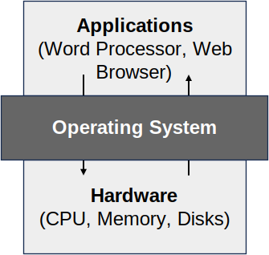

# Introduction to Operating Systems
On most modern computers, we can run software on them without having to worry about the specific details of the underlying components. For instance, we can open Google Chrome on computers without needing to know the specific make and model of our CPU; and we can open Microsoft Word on a computer without worrying about whether we have a Hard Disk Drive or a Solid State Drive. 

This is only possible thanks to a piece of software called the Operating System which hides those hardware specific details. In this course, we will examine the abstractions and interface that an Operating System provides to user-level programs. We will explore how to efficiently allocate, share and manage the CPU, memory, persistent storage, I/O devices, and communications between competing processes.

## What is an Operating System?
A computer is a complex and connected system that consists of various hardware devices such as a processor (sometimes multiple processors), main memory (i.e., RAM), disks (e.g., Hard Drive & Solid State Drives), and other peripherals devices (such as a mouse, network interface, or printer).

Because there are so many parts that must constantly interact with one another, effectively managing and using each component to its full potential can be a daunting task. For instance, if we had to consider CPU clock speed, RAM capacity, and screen resolution just to write a simple "Hello, World!" program, programming would quickly become a nightmare.

Hence, most computers are equipped with a software called an **operating system** which:
1. **Manages** **resources** of the system and
2. **Abstracts** specific hardware **details** by providing a standard interface for accessing hardware.

