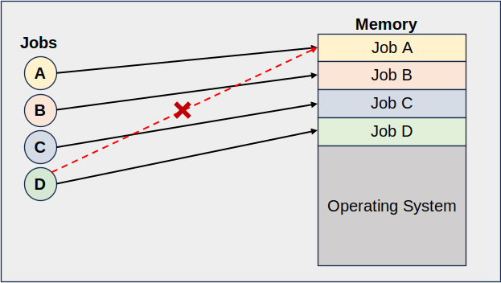

# Abstracting Details
> An operating system is a piece of software that manages resources and **abstracts details**.

We saw before that the abstractions provided by the operating systems help us write programs without having to know specific details about the hardware. For example, we can write a simple Hello World program by calling the `printf()` function without having to worry about the CPU speed, RAM capacity, or screen size. By abstracting away hardware specifics, the programmer is freed to focus more on software design principles rather than hardware details.

We will see that the operating system provides a standard interface (much like a standard library) that allow us to interact with and manipulate the hardware without having to worry about the specifics.

## Resource Protection & Exclusive Access
In the early days of computing, resources such as *memory capacity* and *CPU time* were so limited that we could only run one program at a time. For instance, to run four programs (A-D), we would need to run program A to completion, then program B, then C, and lastly D. During this time, there was no need for resource management. Since only one process was running at a given time, we simply gave that process **exclusive access** to all of our system resources until the program terminated.

However, as computers became much more powerful, users wanted to start running multiple programs simultaneously. Yet, the computers were not powerful enough to give every program everything it requested. This meant that the systems resources would need to be shared among the running programs. [^trivial] Memory, for instance, had to be divided so that programs could each load instructions and data. Similarly, CPU time had to be divided so that a portion of CPU time went to each process.

Furthermore, with multiple programs running, we now ran the issue of a program accessing resources held by other programs. For example, how would we ensure that a music player doesn't access the region of memory that is being used by a password manager? 

One solution would be to force each software builder to implement their own memory protection scheme for each program. However, this is cumbersome/difficult, and more importantly takes the developer away from the actual software engineering. 

Instead, we can use the power of the operating system (as the middle man between software and hardware) to implement a global memory protection scheme. By forcing the programs to go through the operating system to ask for a resource, we can ensure that no process can access a resource that is held by another (by denying requests). Once a program requests a resource and is granted access to it, the program can use the resource without needing to worry about any other programs accessing it (as access to it is protected by the operating system).

Abstracting the details of this interface, from the program's perspective, this approach looks exactly like **exclusive access**. 

We will discuss how this works more in depth when we talk about [system calls](../system_calls/system_call.md).

---

[^trivial] If all of the programs were able to get everything it requested, resource management would become trivial as we could allocated all the resources to all the process.