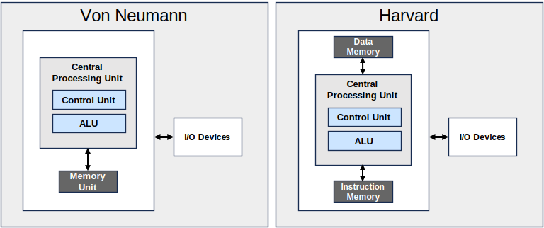

# Managing Resources
> An operating system is a piece of software that **manages resources** and abstracts details.

Broadly speaking, a **resource** is something of a finite quantity that is needed by a system to conduct its tasks. Or put another way, a resource is something that restricts the computer system from carrying out its tasks.

## CPU Time
One of the most important, yet often overlooked, resource in a system is **CPU time**. CPU time is finite in that the CPU can only execute a limited number of instructions in a given time. For example, a 3 GHz processor can run at most 3 billion instructions each second. Since there are multiple processes[^process-def] running simultaneously on a modern computer, the CPU time is the amount of time allocated to each process to execute instructions. When a process runs out of CPU time, the control of the CPU is given to another process which begins to execute its instructions. Hence, if a process wanted to do more work (execute more instructions), it would need more CPU time allocated to itself. That is, the CPU time restricts the process's capacity to execute more instructions.

We will see later how we can optimally manage the CPU time when we talk about [scheduling](../scheduling/intro.md).

## Memory
Another common resource in a computer is **memory**. Since most computers store instructions in memory before the CPU executes them, how much memory we have determines how many instructions can be loaded into memory (which is executed by the CPU). Hence, to do more work (execute more instructions), we need more memory. That is to say, memory restricts the systems's capacity to execute more instructions.

We will see how to optimally manage memory usage when we talk about [Memory Management](../memory/intro.md).

### Von Neumann Architecture
As an aside, computers that store both CPU instructions and data in the same memory (RAM) is said to be of the [Von Neumann architecture](https://en.wikipedia.org/wiki/Von_Neumann_architecture). In contrast, the [Harvard architecture](https://en.wikipedia.org/wiki/Harvard_architecture) has two separate memories (one for data and another for code). 

The Von Neumann architecture allows the CPU to fetch both data and instructions using the same data path which makes the electrical circuit much more simple to implement. As such, many computers nowadays follow the Von Neumann architecture for its simplicity. [^modern-harvard]

One interesting side effect of the Von Neumann architecture is the possibility for self-modifying code. Since both code and data live in the same memory, it is possible to write a program which modifies its own code as it runs.[^self-mod-code] This is possible because code and data are stored simply as 1s and 0s in memory and only interpreted as either code or data depending on the context as it is read.

## I/O Devices
**Input/Output device** is a class of system resources that include disks and vast array of peripheral devices (such as a mouse or a printer). Disks allow us to cheaply store code and data currently not in use. This frees up the limited memory capacity (which is much more costly to expand). However, since all program executables are stored on disks prior to running, disk capacity can also limit our abilities to run programs. We will see how to optimally manage disk space when we talk about [File Systems](../memory/intro.md).

On the other hand, the limiting factor in peripheral devices is how many processes can access them simultaneously. For instance, if we had two instances of Microsoft Word sending a document to a printer, one of the documents would need to wait until the other document finished printing. Similarly, limited access to a peripheral device can stop the process from executing, restricting our ability to run more programs.

# Security
**Security** is a concept that is heavily intertwined with the resource management. A common form of security is *access control* which determines whether a entity such as a user or a process has access to a specific resource. If the entity has the correct permissions or a set of conditions are met, access is granted; else it is not.

Since the operating system is responsible for managing resources, it is also a great place to implement security. Throughout this course, we will see various methods and implementations that allow for a better security of our computers. We will often ask questions such as “*Even if you could physically access resource X, should you be allowed to?,*” and explore the topics of *security* and *availability*. 

---
[^process-def] A process is a *instance* of a program.

[^modern-harvard] Although the Von Neumann architecture is far more prevalent, modern CPUs also implement a split L1 cache with separate code and data caches. Hence, it might be argued that these CPUs follow both the Von Neumann and Harvard architectures.

[^self-mod-code] Self-modifying programs are heavily discouraged as they can lead to severe security issues. In fact, most modern CPUs, compilers, and operating systems have safe guards in place to prevent this from happening.