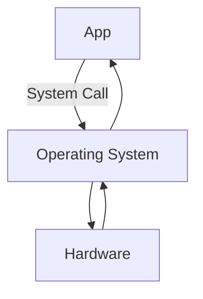
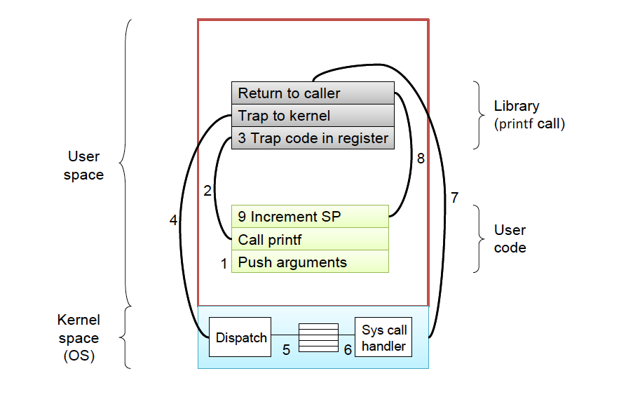

# System Calls
**System calls** are how programs communicate with the operating system (which in turn communicates with the actual hardware). Recall that when we were programming using low-level assembly, for instance [MIPS assembly](https://en.wikipedia.org/wiki/MIPS_architecture), we used system calls for input/output, management of the processes (such as terminate), and system-level randomness (for cryptography). In a more broader sense, a system call is how a program asks an operating system to perform a task (such as read user input) on its behalf. As such, we can think of a system call to be similar to a control transfer (like the `jal` instruction).





Almost all programming languages (besides perhaps the assembly language) has a standard library. Thus, if a program makes a call to a function in that library, it must be linked during compilation, and then loaded into memory during run-time (as a consequence of the Von Neumann architecture).

## A deep dive at `Hello, World!`

Consider a simple "*Hello World!*" Program written in C:
```C
#include <stdio.h>
int main()
{
   printf("Hello, World!"); // <-- call to standard library function printf()
   return 0;
}
```
Notice that we use the standard library's `printf()` function to handle the printing of our string to the standard output. As a result, when the above code is compiled into an executable, and assembled into assembly, the function call will be handled by a jump instruction (such as `jal`) to transfer the control from the *"Hello World!"* program's code into the code of `printf()`.

However, if we were to examine the code for the `printf()` function, we will see that the majority of the code focuses on the stringification and interpolation of the argument string (using appropriate format specifiers), rather than the work for printing to the screen. In fact, by the time we reach the end of the `printf()` function, we are left with a formatted string which has not been displayed to the standard output.

In reality, the task of displaying the string to the screen is much more complex because it requires manipulating the hardware that controls the exact pixels on the screen. As an example, when we want to print "`Hello, World!`" to the screen, we must:
1. First, read the font[^font] and make the appropriate calculations to determine how to draw each character.
2. Next, determine where the terminal is, and what line and column to display the string.[^line-wrap]
3. Finally, with all the information loaded into memory, use instructions to manipulate physical hardware to turn on/off the necessary pixels.

[^font] Fonts are files which describe how each character in a character set is drawn

[^line-wrap] In addition to this, we may also wish to consider line-wraps, word-breaking, and font colors

Even for a simple program like *"Hello World!"* we can see that this process involves a lot of detail about the underlying hardware. As such, tasks like these are best left abstracted for a general library function like `printf()`. And since, we are abstracting details about the hardware, this is a job for the operating system!



Thus, just before `printf()` returns, it makes a **system call** (with yet another control transfer) with arguments to declare the location of output, `stdout`, and the formatted string[^verify]. However, at a high level, the system call simply tells the OS to do some task (print to stdout) and then return once the task is complete. The details of how that task is done is abstracted. However, at its core, a system call can be considered to be some conditional work. When a system call is made, the operating system determines if the application has access to the requested resource and conducts the work that is requested only when the conditions (such as security policy, resource availability, etc.) are satisfied.
```
System Call <- if (condition) {
                  do OS_task;
               }
```

[^verify] We can verify this by examining the assembly code for the "Hello, World!" program.


